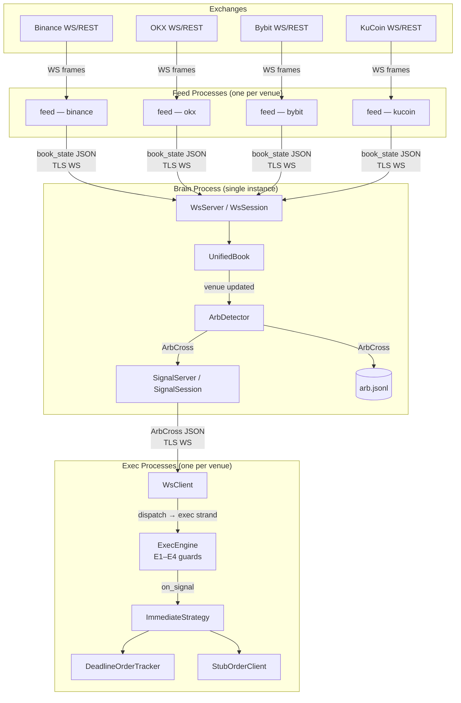
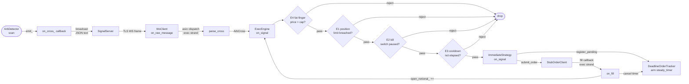
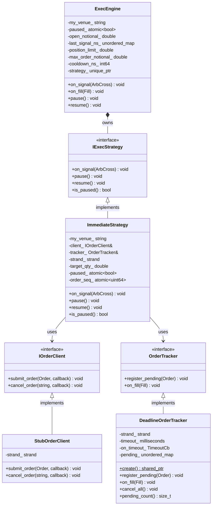
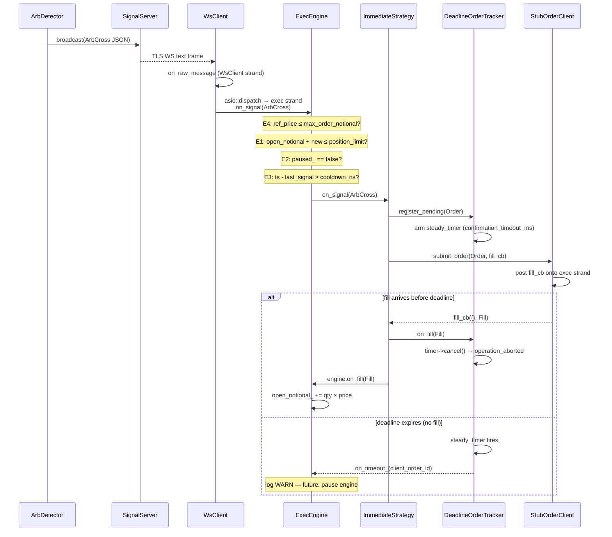

# Architecture Diagrams

Rendered natively on GitHub and in VS Code (Markdown Preview Mermaid Support extension).

---

## 1. Component Architecture

Full stack from exchange WebSocket feeds through PoP/feed ingestion, brain arb detection, and exec order dispatch.

---

## 2. ArbCross Data Flow

How a single arbitrage signal travels from detection in the brain to order dispatch in exec.

---

## 3. Exec Layer Class Diagram

Interfaces, concrete implementations, and ownership relationships in the exec/ module.

---

## 4. Signal Lifecycle Sequence

One arb cross from brain detection to fill confirmation, including the E1–E4 guard chain and the E5 deadline timer.

