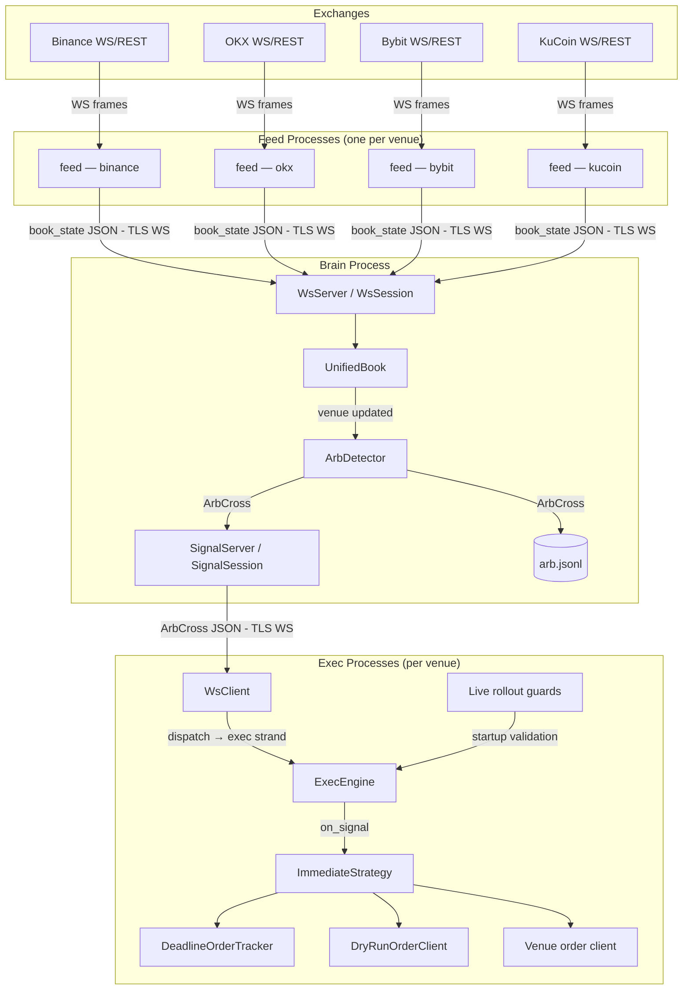
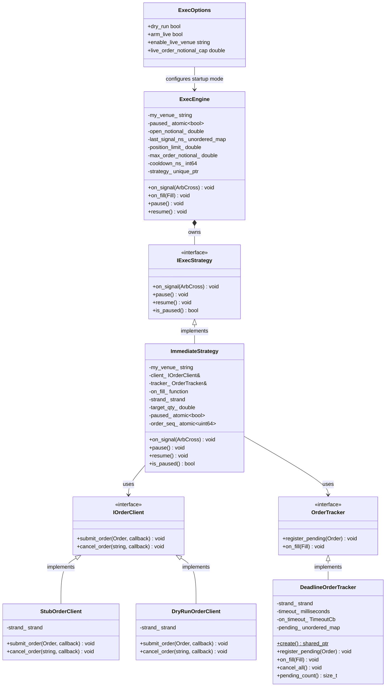
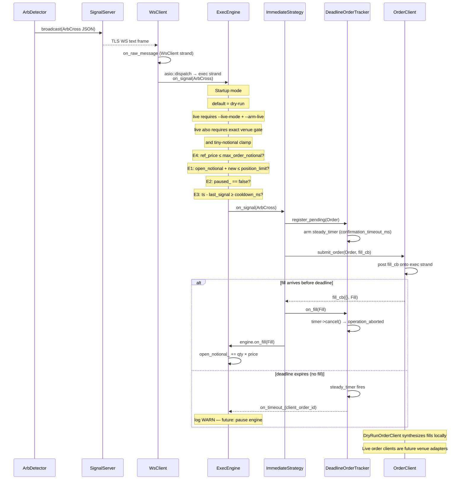
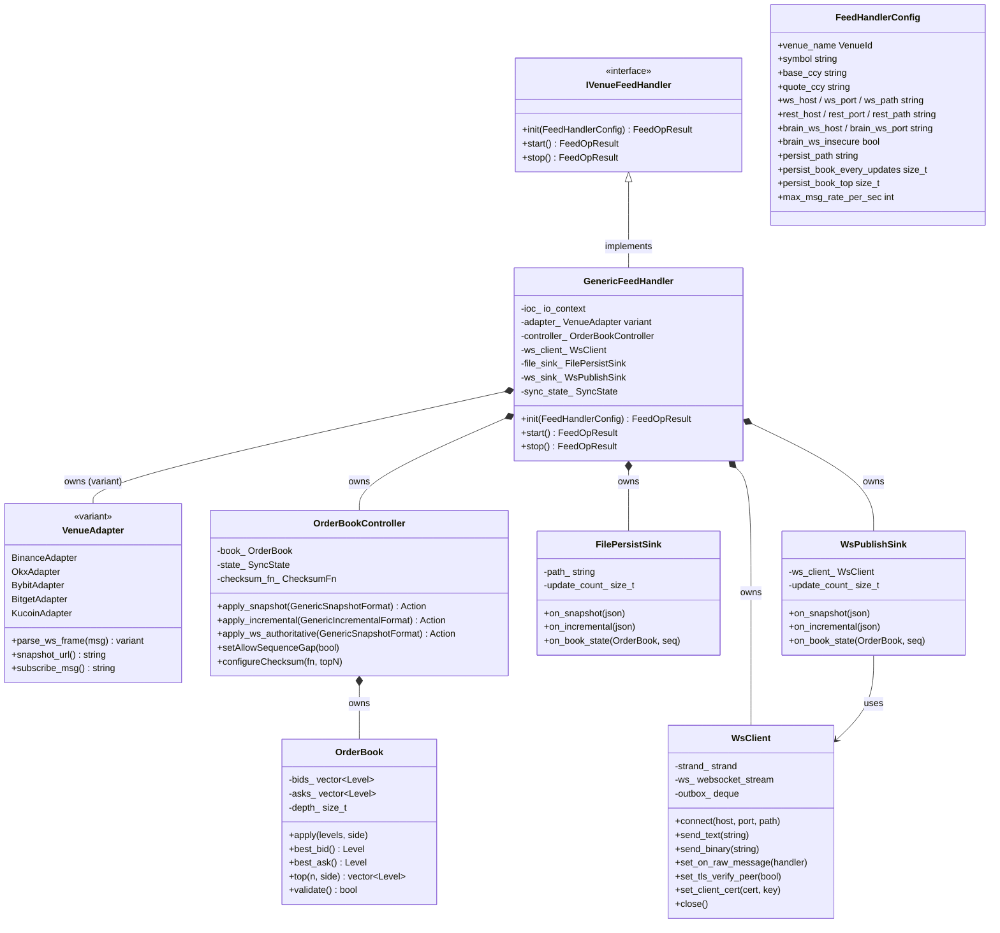
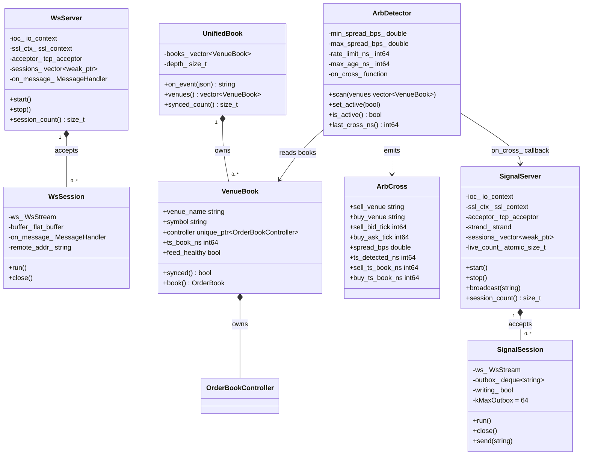

# Architecture Diagrams

Rendered natively on GitHub and in VS Code (Markdown Preview Mermaid Support extension).

---

## 1. Component Architecture

Full stack from exchange WebSocket feeds through PoP/feed ingestion, brain arb detection, and exec order dispatch.



---

## 2. ArbCross Data Flow

How a single arbitrage signal travels from detection in the brain to order dispatch in exec.

```mermaid
flowchart LR
    A([ArbDetector - scan]) -->|emit_| B[on_cross_ callback]
    B -->|broadcast - JSON text| C[SignalServer]
    C -->|TLS WS frame| D[WsClient - on_raw_message]
    D -->|asio::dispatch - exec strand| E[parse_cross]
    E -->|ArbCross| F[ExecEngine - on_signal]

    F --> G{E4 fat-finger - price > cap?}
    G -->|reject| Z([drop])
    G -->|pass| H{E1 position - limit breached?}
    H -->|reject| Z
    H -->|pass| I{E2 kill - switch paused?}
    I -->|reject| Z
    I -->|pass| J{E3 cooldown - not elapsed?}
    J -->|reject| Z
    J -->|pass| K[ImmediateStrategy - on_signal]

    K -->|register_pending| L[DeadlineOrderTracker - arm steady_timer]
    K -->|submit_order| M[Order client]
    M -->|fill callback - exec strand| N[on_fill]
    N -->|cancel timer| L
    N -->|open_notional_ +=| F

    Note over M: In dry-run mode, Order client = DryRunOrderClient
    Note over M: In live mode, startup guards must pass first
```

---

## 3. Exec Layer Class Diagram

Interfaces, concrete implementations, and ownership relationships in the exec/ module.



---

## 4. Signal Lifecycle Sequence

One arb cross from brain detection to fill confirmation, including the E1–E4 guard chain and the E5 deadline timer.



---

## 5. Feed Layer Class Diagram

Classes in `feed/` (per-venue market data ingestion) and the shared `common/` orderbook library.



---

## 6. Brain Layer Class Diagram

Classes in `brain/` — inbound feed server, book aggregation, arb detection, and outbound signal push.


